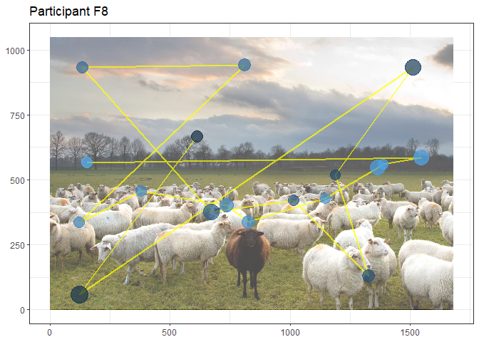
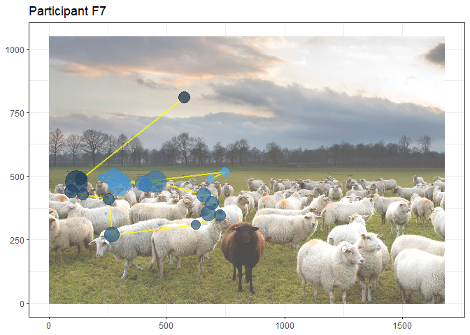
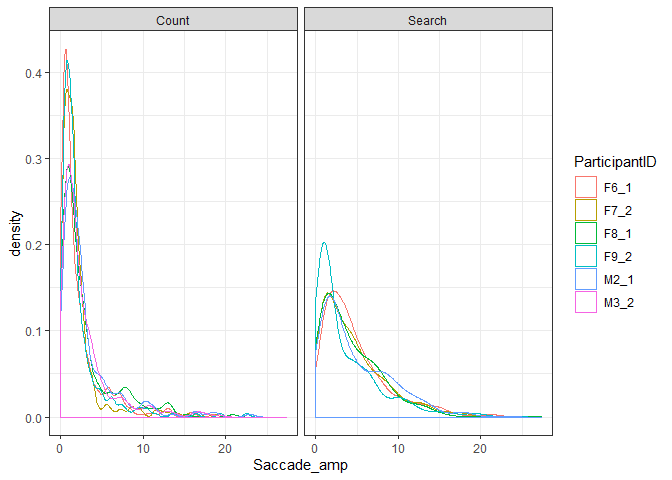
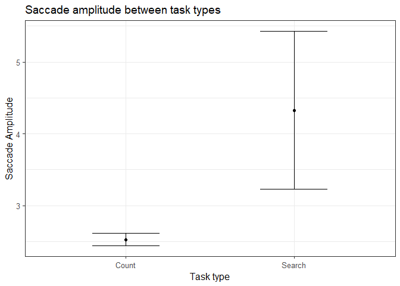
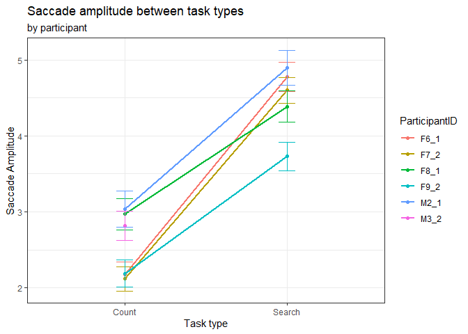
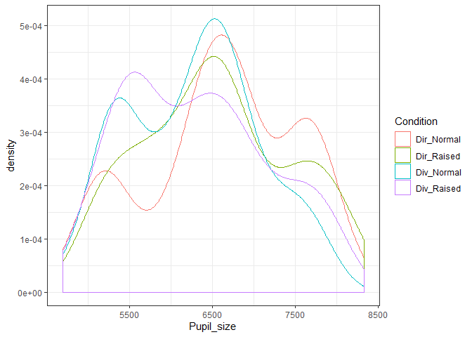
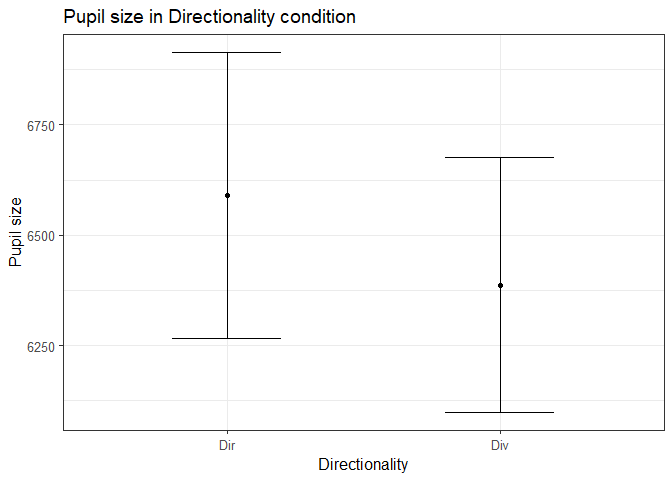
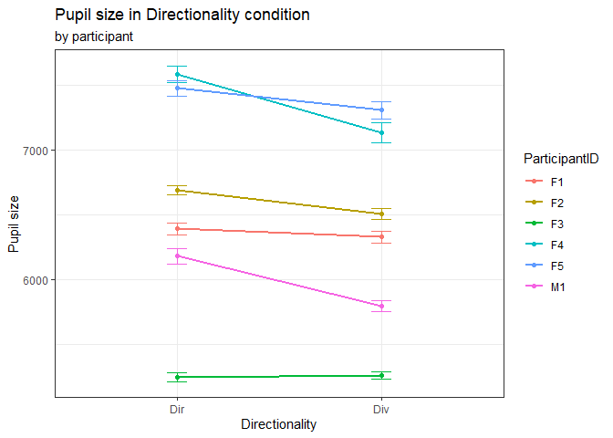

``` r
#Reading the data
Samples <- read_csv("Exported_EyeLink_data/Samples_merged.csv", col_types = cols(
ParticipantID = col_character(),
ParticipantGender = col_character(),
EyeTracked = col_character(),
Task = col_character(),
SearchOrder = col_double(),
ForagingType = col_character(),
Trial = col_double(),
Stimulus = col_character(),
Video = col_character(),
Time = col_double(),
GazeX = col_double(),
GazeY = col_double(),
PupilSize = col_double(),
FixationNo = col_double(),
Fix_StartTime = col_double(),
Fix_EndTime = col_double(),
Fix_Duration = col_double(),
Fix_MeanX = col_double(),
Fix_MeanY = col_double(),
Fix_MeanPupilSize = col_double(),
SaccadeNo = col_double(),
Sac_StartTime = col_double(),
Sac_EndTime = col_double(),
Sac_Duration = col_double(),
Sac_StartX = col_double(),
Sac_StartY = col_double(),
Sac_EndX = col_double(),
Sac_EndY = col_double(),
Sac_PeakVelocity = col_double(),
Sac_MeanVelocity = col_double(),
Sac_Blink = col_logical(),
Sac_Direction = col_character(),
Sac_Amplitude = col_double()
))

#Removing extreme data 
Samples <- Samples %>% 
  mutate(GazeY = 1051-GazeY, Fix_MeanY = 1051-Fix_MeanY) %>% #flipping the y-axis
  filter(Time<=41202) %>% 
  filter(GazeX >= 0 & GazeX <= 1680 & GazeY >= 0 & GazeY <= 1050)
```

``` r
#Only sheep picture for individual participants
img <- readJPEG('stimuli_Foraging/sheep.jpg')
img <- rasterGrob(img, width=unit(1, "npc"), height = unit(1,"npc"), interpolate = FALSE)

#Make subset of data for participant 8
F8_1 <- Samples[!is.na(Samples$FixationNo),] %>% 
  filter(Task == "Foraging", ParticipantID == "F8_1", Stimulus == "sheep.jpg") %>% 
  group_by(ParticipantID, Trial, FixationNo) %>%
  summarize(MeanX = Fix_MeanX[1], MeanY = Fix_MeanY[1], Duration = Fix_Duration[1], Stimulus = Stimulus[1]) %>%
  filter(Duration>=300)

#Plotting scan path for participant 8 in the search condition
ggplot(F8_1, aes(MeanX, MeanY, color = FixationNo)) +
    annotation_custom(img, xmin = 0, xmax = 1680, ymin = 0, ymax = 1050) +
    annotate(geom = "rect", xmin = 0, xmax = 1680, ymin = 0, ymax = 1050, fill = "white", alpha = .3) +
    geom_path(color = "yellow", size = 1, alpha = 0.7) + geom_point(size = F8_1$Duration/min(F8_1$Duration)*5, alpha = .7) +
    xlim(0,1680) + ylim(0,1050) + 
  theme(legend.position = "none", axis.title = element_blank()) + ggtitle("Participant F8")
```



``` r
#Make subset of data for participant 7
F7_2 <- Samples[!is.na(Samples$FixationNo),] %>% 
  filter(Task == "Foraging", ParticipantID == "F7_2", Stimulus == "sheep.jpg") %>% 
  group_by(ParticipantID, Trial, FixationNo) %>%
  summarize(MeanX = Fix_MeanX[1], MeanY = Fix_MeanY[1], Duration = Fix_Duration[1], Stimulus = Stimulus[1]) %>%
  filter(Duration>=300)

#Plotting scan path for participant 7 in the count condition
ggplot(F7_2, aes(MeanX, MeanY, color = FixationNo)) +
    annotation_custom(img, xmin = 0, xmax = 1680, ymin = 0, ymax = 1050) +
    annotate(geom = "rect", xmin = 0, xmax = 1680, ymin = 0, ymax = 1050, fill = "white", alpha = .3) +
    geom_path(color = "yellow", size = 1, alpha = 0.7) + geom_point(size = F7_2$Duration/min(F7_2$Duration)*4, alpha = .7) +
    xlim(0,1680) + ylim(0,1050) + 
  theme(legend.position = "none", axis.title = element_blank()) + ggtitle("Participant F7")
```



``` r
#Splitting data into the foraging experiment and removing NA's in Saccade amplitude
Foraging2 <- Samples %>% subset(Task == "Foraging" & !is.na(Samples$Sac_Amplitude)) %>%
  group_by(ParticipantID, Stimulus, SaccadeNo) %>% #grouping by Participant, Stimulus/Trial and SaccadeNo
  summarise(Saccade_amp = mean(Sac_Amplitude), #computing mean Saccade amplitude for each Saccade
            Saccade_Number = max(SaccadeNo),
            Type = ForagingType[1]) #Assigning condition

#Create density plot of Saccade amplitude
ggplot(Foraging2, aes(Saccade_amp, color = ParticipantID))+
  geom_density()+
  facet_wrap(.~Type)
```



``` r
#Specifying model
model_sac_Amp <- glmer((Saccade_amp ~1+Type + (1+Type|ParticipantID)+(1+Type|Stimulus)),
                  data = Foraging2, family = gaussian(link ="log"), REML = F,
                  control = glmerControl(
  optimizer = "nloptwrap",
  calc.derivs = F,
  optCtrl = list(
    ftol_abs = 1e-10,
    xtol_abs = 1e-10,
    maxeval = 10000
  )))

(mod_sum <- summary(model_sac_Amp)) #displaying summary
```

    ## Generalized linear mixed model fit by maximum likelihood (Laplace
    ##   Approximation) [glmerMod]
    ##  Family: gaussian  ( log )
    ## Formula: 
    ## Saccade_amp ~ 1 + Type + (1 + Type | ParticipantID) + (1 + Type |  
    ##     Stimulus)
    ##    Data: Foraging2
    ## Control: 
    ## glmerControl(optimizer = "nloptwrap", calc.derivs = F, optCtrl = list(ftol_abs = 1e-10,  
    ##     xtol_abs = 1e-10, maxeval = 10000))
    ## 
    ##      AIC      BIC   logLik deviance df.resid 
    ##    20430    20486   -10206    20412     3752 
    ## 
    ## Scaled residuals: 
    ##     Min      1Q  Median      3Q     Max 
    ## -1.5868 -0.6024 -0.3035  0.3152  6.2017 
    ## 
    ## Random effects:
    ##  Groups        Name        Variance Std.Dev. Corr
    ##  Stimulus      (Intercept)  0.0000  0.0000       
    ##                TypeSearch   0.3843  0.6199    NaN
    ##  ParticipantID (Intercept)  0.0000  0.0000       
    ##                TypeSearch   0.1258  0.3547    NaN
    ##  Residual                  13.0548  3.6131       
    ## Number of obs: 3761, groups:  Stimulus, 10; ParticipantID, 6
    ## 
    ## Fixed effects:
    ##             Estimate Std. Error t value Pr(>|z|)    
    ## (Intercept)  0.92693    0.03554  26.082   <2e-16 ***
    ## TypeSearch   0.53745    0.25665   2.094   0.0363 *  
    ## ---
    ## Signif. codes:  0 '***' 0.001 '**' 0.01 '*' 0.05 '.' 0.1 ' ' 1
    ## 
    ## Correlation of Fixed Effects:
    ##            (Intr)
    ## TypeSearch -0.138

``` r
#Making log estimates interpretable by exponentiating the sum of both estimates and subtracting
#the exponentiated beta value
exp(mod_sum$coefficients[1]+mod_sum$coefficients[2]) - exp(mod_sum$coefficients[1])
```

    ## [1] 1.798103

``` r
#Exponentiating the standard error
exp(mod_sum$coefficients[2,2])
```

    ## [1] 1.29259

``` r
#Computing R squared (marginal and conditional)
MuMIn::r.squaredGLMM(model_sac_Amp)
```

    ##             R2m        R2c
    ## [1,] 0.00527982 0.02693565

``` r
#Saving effect of task type in data frame
ef <- effect(term = "Type" , mod = model_sac_Amp)
x <- as.data.frame(ef)

#Plotting difference in saccade amplitude across participants in task type
ggplot(x, aes(Type, fit))+
  geom_point()+
  geom_errorbar(aes(ymin=fit-se, ymax=fit+se), width=0.4)+
  theme_bw(base_size=12)+ labs(x="Task type",y="Saccade Amplitude")+
  ggtitle("Saccade amplitude between task types")
```



``` r
#Creating spaghetti plot for Pupil size as an effect of group in direction condition
ggplot(Foraging2, aes(Type,Saccade_amp,colour=ParticipantID))+
  stat_summary(fun.y = mean,geom="point")+
  stat_summary(fun.y=mean,geom="line",aes(group=ParticipantID),size=1)+
  geom_errorbar(stat = "summary", fun.data = mean_se, width = 0.1)+
  labs(x="Task type",y="Saccade Amplitude")+
  ggtitle("Saccade amplitude between task types", "by participant")
```



Social Engagement task

``` r
#Splitting data into the foraging experiment and removing NA's in Fixation number
Soc_Eng <- Samples %>% subset(Task == "SocialEngagement" & !is.na(Samples$FixationNo)) %>%
  group_by(ParticipantID, Video, FixationNo) %>% #grouping by Participant, Video/Trial and SaccadeNo
  summarise(Pupil_size = mean(PupilSize), #compute mean Pupil size for each fixation
            Fixation_Number = FixationNo[1])

#Creating columns indicating conditions from the 2x2 factorial design
Soc_Eng <- Soc_Eng %>% 
  mutate(Direction = ifelse(str_detect(Video, "div"), "Div", "Dir"), #creating column designating divergent or direct stimuli
         Eyebrow = ifelse(str_detect(Video, "[+]o"), "Raised", "Normal"), #creating column designating raised or "normal" eyebrows in stimuli
         Condition = paste(Direction, Eyebrow, sep = "_"))


#Create density plot of pupil size for each condition
ggplot(Soc_Eng, aes(Pupil_size, color = Condition))+
  geom_density()
```



``` r
#Specifying model assuming a normal distribution of the data
model_soc_eng <- lmer((Pupil_size ~ 1+Eyebrow+Direction + (1+Eyebrow+Direction|ParticipantID)), data = Soc_Eng, REML = F,  control = lmerControl(
  optimizer = "nloptwrap",
  calc.derivs = F,
  optCtrl = list(
    ftol_abs = 1e-10,
    xtol_abs = 1e-10,
    maxeval = 10000
  )))

#saving and displaying model summary
(mod_sum2 <- summary(model_soc_eng))
```

    ## Linear mixed model fit by maximum likelihood . t-tests use
    ##   Satterthwaite's method [lmerModLmerTest]
    ## Formula: 
    ## (Pupil_size ~ 1 + Eyebrow + Direction + (1 + Eyebrow + Direction |  
    ##     ParticipantID))
    ##    Data: Soc_Eng
    ## Control: 
    ## lmerControl(optimizer = "nloptwrap", calc.derivs = F, optCtrl = list(ftol_abs = 1e-10,  
    ##     xtol_abs = 1e-10, maxeval = 10000))
    ## 
    ##      AIC      BIC   logLik deviance df.resid 
    ##   8044.0   8087.1  -4012.0   8024.0      540 
    ## 
    ## Scaled residuals: 
    ##     Min      1Q  Median      3Q     Max 
    ## -3.4397 -0.5949  0.1057  0.6805  2.5853 
    ## 
    ## Random effects:
    ##  Groups        Name          Variance Std.Dev. Corr       
    ##  ParticipantID (Intercept)   622043   788.7               
    ##                EyebrowRaised  30597   174.9    -0.04      
    ##                DirectionDiv   22219   149.1    -0.59 -0.44
    ##  Residual                    114757   338.8               
    ## Number of obs: 550, groups:  ParticipantID, 6
    ## 
    ## Fixed effects:
    ##               Estimate Std. Error       df t value Pr(>|t|)    
    ## (Intercept)   6589.096    322.905    6.006  20.406 8.91e-07 ***
    ## EyebrowRaised    1.330     77.202    6.051   0.017   0.9868    
    ## DirectionDiv  -203.341     67.509    6.150  -3.012   0.0229 *  
    ## ---
    ## Signif. codes:  0 '***' 0.001 '**' 0.01 '*' 0.05 '.' 0.1 ' ' 1
    ## 
    ## Correlation of Fixed Effects:
    ##             (Intr) EybrwR
    ## EyebrowRasd -0.048       
    ## DirectionDv -0.546 -0.364

``` r
#Computing R squared (marginal and conditional)
MuMIn::r.squaredGLMM(model_soc_eng)
```

    ##             R2m       R2c
    ## [1,] 0.01488584 0.8349389

``` r
#Saving effect of direction condition in data frame
ef2 <- effect(term = "Direction" , mod = model_soc_eng)
x2 <- as.data.frame(ef2)

#Plotting difference in pupil size across participants in directionality conditions
ggplot(x2, aes(Direction, fit))+
  geom_point()+
  geom_errorbar(aes(ymin=fit-se, ymax=fit+se), width=0.4)+
  theme_bw(base_size=12)+ labs(x="Directionality",y="Pupil size")+
  ggtitle("Pupil size in Directionality condition")
```



``` r
#Creating spaghetti plot for Pupil size as an effect of directionality condition
ggplot(Soc_Eng,aes(Direction,Pupil_size,colour=ParticipantID))+
  stat_summary(fun.y = mean,geom="point")+
  stat_summary(fun.y=mean,geom="line",aes(group=ParticipantID),size=1)+
  geom_errorbar(stat = "summary", fun.data = mean_se, width = 0.1)+
  labs(x="Directionality",y="Pupil size")+
  ggtitle("Pupil size in Directionality condition", "by participant")
```


